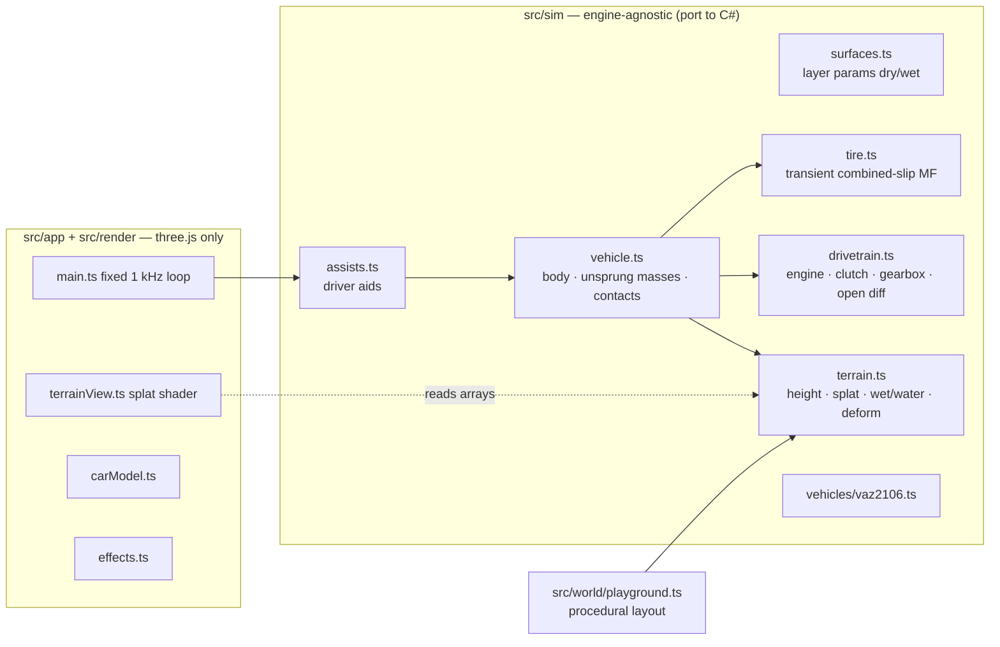

# VAZ-2106 vehicle physics prototype (three.js → Unity)

A prototype of a realistic vehicle system. The first car is the VAZ-2106 (Lada 1600). It drives on a procedural playground with tarmac, sand, mud and grass, each in a dry and a wet variant, plus puddles and a lake. The simulation core does not depend on three.js, so it can be ported to Unity C# almost line for line.

```bash
npm install
npm run dev        # http://localhost:5173
npm run sim        # headless benchmarks (factory figures, per-surface, transitions)
npm run build      # typecheck + production bundle
```

## Controls

| | |
|---|---|
| W / S, ↑ / ↓ | throttle / brake. In auto mode, holding S at a standstill selects reverse |
| A / D, ← / → | steer |
| Space | handbrake (rear drums) |
| Shift | clutch pedal |
| E / Q | gear up / down |
| I | start the engine · L headlights |
| C | camera: chase, front-left wheel close-up, bonnet, mouse orbit |
| T / F / H | telemetry / contact force arrows / help |
| 1–6 | teleport: skid pad, transition lane, shoulder drop-off, mud pit, beach & lake, wet ring road |
| R | reset the car (back to the last teleport if it's in the lake) |
| Esc / O | driving assists settings |

Gamepad (standard mapping): left stick steers, RT/LT throttle/brake, B handbrake, X clutch, RB/LB shift, Y camera, Back reset.

## Driving assists (settings panel)

A keyboard only gives 0 or 1, so the assists are optional systems. Each one can be switched on or off, and the settings persist in `localStorage`. There are three presets: **Simulation (stock 2106)**, **Keyboard** (the default) and **Fully assisted**.

- **Steering assist** (0–1): speed-sensitive steering. Full input puts the front tires at their peak slip angle *relative to the front axle's direction of travel*. The peak comes from the surface currently under the tires, so the usable lock shrinks on wet tarmac and grows in sand.
- **Countersteer** (0–1): when oversteer is detected (the front axle moves opposite to the yaw rotation), the wheels turn into the slide. This fades out as the driver steers.
- **Keyboard steering speed**, **pedal smoothing**: input filtering only. They don't change the physics.
- **ABS**: uses wheel-speed slip and keeps it within a band around the surface's peak slip.
- **TCS**: cuts throttle based on slip speed, and brakes the spinning rear wheel so the open differential sends torque to the other one.
- **ESC**: compares yaw rate with a reference model. On oversteer it brakes the outer front wheel; on understeer it brakes the inner rear wheel and cuts power.
- **Automatic clutch** (launch, anti-stall, shifts) and **automatic gear changes**. Upshifts are blocked when the rpm comes only from wheelspin.

A real 2106 had none of the electronic systems.

## Architecture



- `src/sim` has no imports from three.js or the DOM. It uses its own `Vec3`/`Quat`, plain data specs and typed arrays.
- The app runs physics at a **fixed 1000 Hz** and renders at display rate. At 1 kHz the tire relaxation, the clutch lock and the unsprung-mass/tire-spring modes are all integrated stably. One simulated second costs about 30 ms of CPU.
- Coordinate system: right-handed, +Y up, the car faces −Z, +X is right.

## Physics model

**Chassis**: a 6-DOF rigid body with diagonal inertia, integrated with semi-implicit Euler. It has 1120 kg total mass (1045 kg curb weight plus a driver). Aero drag uses Cd 0.48 and A 1.82 m². Hull contact points (sills, bumpers, roof) handle bottoming out, belly-dragging in ruts and rollovers. Deep water adds buoyancy and drag, and hydro-locks the engine when the air intake goes under.

**Suspension**: each wheel has an unsprung mass: 30 kg front, 45 kg rear because of the live axle. Above it sit the spring, damper (separate bump and rebound rates), bump stop and anti-roll coupling. Below it, the tire is a radial spring (180 kN/m). Over an asphalt lip, the tire takes the impact first, and the wheel can hop or lose contact. The rear live axle has its springs mounted inboard, which is modelled as a negative anti-roll rate. Propshaft torque reacts on the axle: under power the right rear unloads, so a 2106 spins its right rear wheel. Lateral tire forces enter the body at the roll-centre height (front 7 cm, rear 33 cm).

**Wheel–ground contact (disc on heightfield)**: each wheel samples 13 points around the arc × 3 strips across the tread. From these it finds the hub height at which the tire circle first touches the ground. The contact normal points from the touch point to the hub, which is exact for a circle. So the tire climbs edges, kerbs and rut walls smoothly, where a single raycast would snap. Across the tread, the load centre is blended between strips; it never jumps to whichever strip is highest.

**Tire**: transient slip states use relaxation lengths (σ·ds/dt + |Vx|·s = slip velocity, Pacejka). This is well-behaved at zero speed and gives a parked car tire "spring". It feeds a normalised combined-slip Magic Formula. The curve shape comes from each surface's `slideRatio`. The peak slip comes from tire stiffness divided by the surface μ and stiffness. Result: wet tarmac peaks early and drops off, while sand peaks late with a flat plateau. The model also includes load sensitivity, low-speed damping, and a friction direction that follows the sliding velocity once the tire is past the peak.

**Drivetrain**: the torque curve is 116 N·m at 3000 rpm and 75 hp at 5400 rpm, with idle-circuit control, a soft limiter and stalling. The clutch is a torque-limited velocity constraint: it either locks rigidly or slips at its capacity. Gearbox ratios are 3.753 / 2.303 / 1.493 / 1.000 / R 3.867, final drive 3.9. The open differential always splits torque 50/50. Brakes: front discs 1250 N·m, rear drums 550 N·m, mechanical rear handbrake. Brake torque, rolling resistance and bulldozing are friction-clamped, so they cannot reverse a wheel's spin.

## Surfaces and the transitions between them

The world stores a splatmap (tarmac, sand, mud, grass), wetness, standing-water depth and a dynamic deformation map (ruts, rubber, mud film). Physics and rendering read the same data. Each layer has a full **dry** and **wet** parameter set (`src/sim/surfaces.ts`): μ, slide ratio, speed sensitivity, slip stiffness, rolling resistance, sinkage, dig rate, bulldozing, relaxation scale, micro-roughness, mud pick-up and hardness.

Driving across a boundary is realistic because of these mechanisms:

1. **Area-weighted contact patch**: friction comes from 3×3 samples over the patch, so a tire on a boundary gets a blended μ. Each wheel samples on its own, which gives split-μ yaw and one-sided pull.
2. **Relaxation length**: tire force follows a surface change over a rolled distance, not instantly. Soft ground lengthens that distance.
3. **Real geometry at edges**: the asphalt sits 4 cm proud of the shoulder, and a sunken wheel has to *climb* back onto the hard surface. Soft ground under the wheel is pushed down by the wheel's own sinkage, but tarmac is not. Coming out of sand, the disc contact therefore meets a step, the tire spring absorbs it, and the car decelerates and pitches. The shoulder lane has a 6 cm drop-off.
4. **Sinkage, ruts and bulldozing**: load sinks the wheel and wheelspin digs it in. Ruts are stamped into a persistent 12.5 cm-resolution map. Rolling resistance grows with *fresh* (uncompacted) sinkage, so a second pass in existing ruts is easier, and rut walls steer the wheels. Sliding sideways in soft soil adds lateral bulldozing force.
5. **Contamination carry-over**: tires pick up mud (shown in telemetry as "mud on tread"). That mud lowers grip on hard surfaces until it is shed over about 20 m. Mud-covered tires deposit a mud film on the tarmac, which lowers grip for the next pass. The end of the mud-pit spur already has mud tracked onto it.
6. **Water**: wet tarmac loses grip with speed. Standing water adds drag on each wheel, so a puddle under one side pulls the car toward it. Hydroplaning starts around Horne's speed (6.36·√p ≈ 90 km/h at 200 kPa). The ring road has one-sided and full-width puddles.
7. **Boundaries are not straight lines**: edges have noise. One edge in the transition lane is diagonal, so the left and right wheels cross it at different times.

## Benchmarks (`npm run sim`)

| Check | Result | Reference |
|---|---|---|
| 0–100 km/h | 16.2 s | ~17 s factory |
| Top speed | 154 km/h | 150 km/h factory |
| Braking 100–0, dry, no ABS / ABS | 54 m / 47 m | 45–55 m for the era |
| Braking 100–0, wet, no ABS / ABS | 97 m / 70 m | |
| Max lateral acceleration, dry / wet | 0.78 g / 0.56 g | |
| 0–50 km/h: tarmac / sand / dry mud / wet grass | 5.8 / 9.3 / 8.4 / 19.4 s | |
| Coast-down 40→20 km/h: tarmac / sand | 36 s / 4.6 s | rolling resistance ≈0.012 / ≈0.15 |
| Split-μ launch, open diff | mud-side wheel spins at 22.8 m/s, car at 13 km/h | |
| Right wheels run onto a sand shoulder at 70 km/h | 4.4° pull toward the sand over 60 m | |
| Handbrake on a 20 % slope | 0 mm creep | |

## Porting to Unity

| Prototype | Unity |
|---|---|
| `Vec3` / `Quat` (right-handed, forward −Z) | `Vector3` / `Quaternion`: negate Z; quaternion (x, y, z, w) → (−x, −y, z, w) |
| `RigidBody` | `Rigidbody` with `AddForceAtPosition`, `inertiaTensor` set, `centerOfMass` at the CG; run the vehicle step in `FixedUpdate` with `Time.fixedDeltaTime = 0.001`, or sub-step it inside a 50–100 Hz `FixedUpdate` |
| Disc contact via `Terrain.sample` | `TerrainData.GetInterpolatedHeight` plus rut texture sampling; or `Physics.SphereCast` / several `Raycast`s for meshes. Don't use `WheelCollider`: it has no relaxation length, surface blending or unsprung-mass dynamics |
| `terrain.splat` (RGBA = 4 layers) | `TerrainData.alphamaps` with 4 `TerrainLayer`s: the same weights feed the physics |
| `terrain.env`, `terrain.deform` | Extra `Texture2D`s (R8/RGBA32) read by the physics and the terrain shader; update rut texels with `SetPixelData` on dirty rects |
| `SurfaceParams`, `VehicleSpec` | `ScriptableObject` assets (dry and wet per layer) |
| `DriverAssists`, `DriverInput` | A plain C# class fed by the Input System |
| `tools/scenarios.ts` | EditMode tests or a benchmark scene that compare against the same numbers |

## Known simplifications

- Suspension geometry is a vertical slider: no camber gain, bump steer or camber thrust. The live axle is two independent unsprung masses plus a pinion-torque reaction, not a single rigid beam.
- Tires have no temperature, wear or pressure dynamics, and no self-aligning torque or steering feedback.
- Soil uses an empirical sinkage/bulldozing model rather than full Bekker–Wong terramechanics. Ruts never recover.
- Rendering: tire tracks come from the rut map; there are no decals. The engine has no sound.
